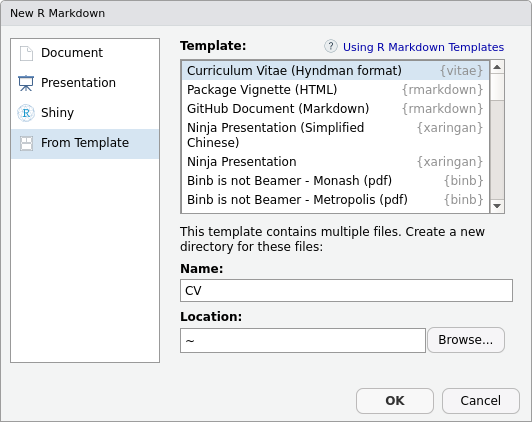

<!-- README.md is generated from README.Rmd. Please edit that file -->

# vitae 

*/ˈviːteɪ/*

[](https://cran.r-project.org/package=vitae)
[](https://travis-ci.org/ropenscilabs/vitae)

## Templates and tools for making a Résumé/CV

The *vitae* package makes creating and maintaining a Résumé or CV with R
Markdown simple. It provides a collection of LaTeX templates, with
helpful functions to add content to the documents.

## Installation

You can install the **release** version from CRAN.

``` r
install.packages('vitae')
```

You can install the **development** version from
[GitHub](https://github.com/ropenscilabs/vitae).

``` r
# install.packages("devtools")
devtools::install_github("ropenscilabs/vitae")
```

This package requires LaTeX to be installed on your computer. If you’re
encountering issues, please check that LaTeX is installed. The [tinytex
package](https://github.com/yihui/tinytex) makes it easy to setup LaTeX
within R:

``` r
install.packages('tinytex')
tinytex::install_tinytex()
```

## Getting started

The *vitae* package currently supports 4 popular CV templates, and
adding more is a relatively simple process (details in the [creating
vitae
templates](https://ropenscilabs.github.io/vitae/articles/extending.html)
vignette).

Creating a new CV with `vitae` can be done using the RStudio R Markdown
template selector: 

These templates leverage the strength of rmarkdown to include common
information in the YAML header (name, position, social links…) and
extended information in the main body. The main body of the CV is
written using markdown, and allows for data-driven generation of entries
using the [`*_entries`
functions](https://ropenscilabs.github.io/vitae/reference/cventries.html).
This allows you to import your working history from other sources (such
as ORCID, Google Scholar, or a maintained dataset), and include them
programatically into your CV.

For example, the [rorcid package](https://github.com/ropensci/rorcid)
can be used to extract [Rob
Hyndman](https://orcid.org/0000-0002-2140-5352)’s education
history:

``` r
orcid_data <- rorcid::orcid_educations("0000-0002-2140-5352")$`0000-0002-2140-5352`
```

    #> 
    #> Attaching package: 'dplyr'
    #> The following objects are masked from 'package:stats':
    #> 
    #>     filter, lag
    #> The following objects are masked from 'package:base':
    #> 
    #>     intersect, setdiff, setequal, union
    #>                      role-title start-date.year.value end-date.year.value
    #> 1                           PhD                  1990                1992
    #> 2 Bachelor of Science (Honours)                  1985                1988
    #>         organization.name organization.address.city
    #> 1 University of Melbourne                 Melbourne
    #> 2 University of Melbourne                 Melbourne

The package provides two types of entries from data, which are
`detailed_entries` and `brief_entries`. Both functions provide sections
for `what`, `when`, and `with`, and the `detailed_entries` additionally
supports `where` and `why`. These arguments support operations, so for
this example, we have used `glue` to combine the start and end years for
our `when` input. Excluding any inputs is also okay (as is done for
`why`), it will just be left blank in the CV.

``` r
orcid_data$`education-summary` %>%
  detailed_entries(
    what = `role-title`,
    when = glue::glue("{`start-date.year.value`} - {`end-date.year.value`}"),
    with = organization.name,
    where = organization.address.city
  )
```


Additional examples of using this package can be found in the slides
presented at [ozunconf2018](https://ozunconf18.ropensci.org/):
<https://mitchelloharawild.com/vitae/>

## Examples of using vitae

  - [Mitchell O’Hara-Wild](https://github.com/mitchelloharawild/CV)
  - [Rob Hyndman](https://github.com/robjhyndman/CV)
  - [Eric R. Scott](https://github.com/Aariq/curriculum-vitae)
  - [Chris
    Umphlett](https://chrisumphlett.github.io/posts/vitae-package/)

Add your vitae to the list using a PR.

-----

Please note that the ‘vitae’ project is released with a [Contributor
Code of Conduct](.github/CODE_OF_CONDUCT.md). By contributing to this
project, you agree to abide by its terms.
